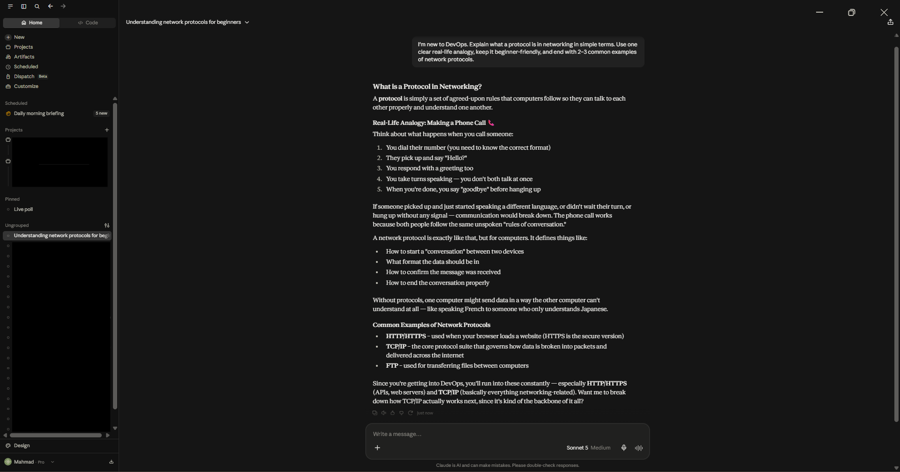
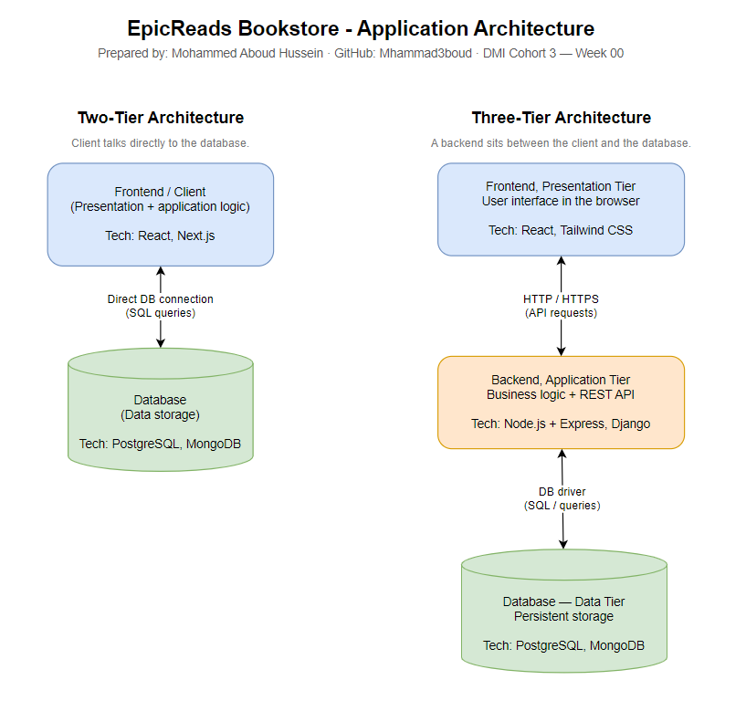
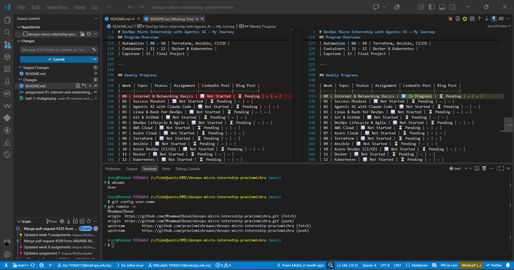

# Week 00 - Internet and Networking

Part of the DevOps Micro Internship (DMI) with Agentic AI

---

# 🧑‍💻 Task 1: Using ChatGPT as Your Learning Assistant

## Scenario

You're new to DevOps and will frequently encounter technical questions. ChatGPT can be your learning companion.

## Your Task

Write a clear ChatGPT prompt to help you understand:

> "What is a protocol in networking? Explain with a simple real-life example."

Take a screenshot of your interaction showing:

* Your detailed prompt (with clear expectations)
* ChatGPT's simplified response with an example

## Screenshot

Save your screenshot in the `screenshots` folder and update the file name below.




Replace `task-1-chatgpt.png` with your actual screenshot file name.

---

## What I Learned (2–3 lines)

A protocol is simply an agreed set of rules that lets two devices exchange data in a way both sides understand — like two people agreeing to speak the same language before a conversation. A real-life example is a phone call: you say "Hello", wait for a reply, take turns, and say "Bye" to end. Networking protocols (HTTP, TCP, IP) define the same kind of format, order, and error handling so computers can communicate reliably.

---

# 🌐 Task 2: Internet and Networking

## Scenario

Your friend is launching an online bookstore named **EpicReads**.

He asked you to explain how users globally can access his website hosted in Finland.

## Your Task

Write a short explanation (**100–150 words**) that includes:

* Packet Switching
* IP Address
* TCP/IP
* HTTP/HTTPS

💡 **Tip:** You may use ChatGPT (as demonstrated in Task 1) to refine your explanation.

## Answer

When a user anywhere in the world opens EpicReads, their browser must reach a server hosted in Finland. First, the request is broken into small **packets**. With **packet switching**, each packet can travel a different route across many networks and routers, and they are reassembled in the correct order when they arrive — this makes the internet fast and resilient. Every device involved has a unique **IP address** that identifies it, so packets know where to go and where to return. **TCP/IP** is the core rulebook: IP handles addressing and routing, while TCP ensures every packet arrives, is in order, and is re-sent if lost. On top of this, the browser and server speak **HTTP** to request and deliver web pages. **HTTPS** adds TLS encryption, so data like logins and payments stays private and cannot be tampered with in transit.

---

# 🏗️ Task 3: Application Architecture & Stack

## Scenario

EpicReads bookstore has two application versions:

### Two-Tier Application

* Frontend
* Database

### Three-Tier Application

* Frontend
* Backend
* Database

## Your Task

* Draw simple diagrams (hand-drawn or tool-based such as draw.io)
* Label each layer clearly
* List at least two common technologies or tools used for each layer
* Submit a screenshot or photo clearly showing your own drawing

## Diagram Screenshot / Photo

Save your diagram image in the `screenshots` folder and update the file name below.




Replace `task-3-diagram.png` with your actual diagram file name.

---

## Technologies Used

### Frontend

* React (with Next.js)
* HTML, CSS & JavaScript / Tailwind CSS

### Backend

* Node.js with Express
* Python with Django or Flask

### Database

* PostgreSQL (relational)
* MongoDB (NoSQL / document)

---

# 🌍 Task 4: Domain Name & DNS (Basic Concepts)

## Scenario

Your friend's bookstore **EpicReads** is currently accessible through:

```text
52.172.142.222:3000
```

He purchased the domain:

```text
epicreads.com
```

## Your Task

In **50–100 words**, explain in your own words:

1. What is DNS (Domain Name System)?
2. Which DNS record type should be used to connect the domain to the given IP, and why?

## Answer

DNS is the internet's phone book. People remember names like `epicreads.com`, but computers connect using IP addresses. When someone visits the domain, DNS resolvers look up the name and return the matching IP address so the browser can reach the correct server.

To point `epicreads.com` to the IPv4 address `52.172.142.222`, an **A (Address) record** should be used, because an A record maps a domain name directly to an IPv4 address. A CNAME cannot be used here since it points to another name, not an IP, and is not allowed on the root domain. The port `:3000` is not handled by DNS — it is managed by the server or a reverse proxy.

---

# 💻 Task 5: Visual Studio Code Setup (Hands-on)

## Your Task

Install Visual Studio Code (if not already installed).

Take a screenshot of your VS Code environment showing:

* Terminal open inside VS Code
* Running a basic command:

### Windows

```powershell
dir
```

### Linux / macOS

```bash
pwd
ls
```

* Your selected VS Code theme clearly visible

⚠️ **Important:** The screenshot must show your username or another identifiable detail to confirm it is your environment.

## Screenshot

Save your screenshot in the `screenshots` folder and update the file name below.




Replace `task-5-vscode.png` with your actual screenshot file name.

---

# 🔗 Task 6: Publish Your Assignment as a LinkedIn Post

## Objective

Publishing on LinkedIn helps you:

* Build your professional online presence
* Reinforce your learning
* Document your DevOps journey publicly

## Your Task

Summarize your answers from Tasks 1–5 into a LinkedIn post.

Clearly structure your post into the following sections:

* ChatGPT
* Internet & Networking
* App Architecture
* DNS
* VS Code Setup

Use the credit note that matches your track:

Add the following credit note at the end of your post **(If you are DMI Cohort 3 student)**:

> **P.S. This post is part of the DevOps Micro Internship (DMI) with Agentic AI — Cohort 3 — by Pravin Mishra. My graded progress is public: https://dmi.pravinmishra.com/s/YOUR-GITHUB-USERNAME.html · Start your DevOps journey: https://dmi.pravinmishra.com/?utm_source=student&utm_medium=ps-linkedin&utm_campaign=cohort3**

**Tag [Pravin Mishra](https://www.linkedin.com/in/pravin-mishra-aws-trainer/) in your LinkedIn post, then tag Lead Co-Mentor — [Anjana Muthunayake](https://www.linkedin.com/in/anjana-muthunayake/).**

Add the following credit note at the end of your post **(If you are DMI Self-paced track student)**:

> **P.S. This post is part of the DevOps Micro Internship (DMI) — Self-Paced Engineer Track — by Pravin Mishra. My graded progress is public: https://dmi.pravinmishra.com/s/YOUR-GITHUB-USERNAME.html · Start your DevOps journey: https://dmi.pravinmishra.com/?utm_source=student&utm_medium=ps-linkedin&utm_campaign=self-paced**

Add the following credit note at the end of your post **(If you are DMI Campus student)**:

> **P.S. This post is part of the DevOps Micro Internship (DMI) — Campus — by Pravin Mishra. My graded progress is public: https://dmi.pravinmishra.com/s/YOUR-GITHUB-USERNAME.html · Start your DevOps journey: https://dmi.pravinmishra.com/?utm_source=student&utm_medium=ps-linkedin&utm_campaign=campus**

**Tag [Pravin Mishra](https://www.linkedin.com/in/pravin-mishra-aws-trainer/) in your LinkedIn post, then tag Lead Co-Mentor — [Anjana Muthunayake](https://www.linkedin.com/in/anjana-muthunayake/).**

Hashtags:

#DMIByPravinMishra #AgenticAI #DevOps

Replace `YOUR-GITHUB-USERNAME` with your GitHub username — that link is your public DMI progress page (your graded badge page).
---

## LinkedIn Post URL

Paste your LinkedIn post URL here:

```text
https://www.linkedin.com/posts/mohammed-hussein-050aa1434_devops-networking-cloudcomputing-share-7502943325956493312-hrN3/
```

---

## LinkedIn Post Backup Copy

Paste the full text of your LinkedIn post here:

🚀 Week 0 of the DevOps Micro Internship (DMI) with Agentic AI — Cohort 3 — done!

This week was all about the foundations: how the internet actually works and setting up my tools. Here's what I learned:

🤖 ChatGPT as a learning assistant
I practiced writing clear, specific prompts to break down technical topics. Asking "explain a networking protocol with a real-life example" gave me a simple analogy: a protocol is just an agreed set of rules — like taking turns on a phone call.

🌐 Internet & Networking
When you open a website, your request is split into packets that travel independently across the network (packet switching) and are reassembled at the other end. Every device has an IP address, TCP/IP guarantees delivery and ordering, and HTTP/HTTPS moves the actual web pages — with HTTPS adding encryption.

🏗️ App Architecture
Two-tier = frontend + database. Three-tier = frontend + backend + database. Separating the backend makes apps easier to scale and secure. Common stacks: React/Next.js, Node.js or Django, PostgreSQL or MongoDB.

🌍 DNS
DNS is the internet's phone book — it turns names like epicreads.com into IP addresses. To point a domain at an IPv4 address, you use an A record.

💻 VS Code Setup
Installed VS Code, opened the integrated terminal, and ran my first commands.

Excited for the weeks ahead! 💪

#DevOps #Networking #CloudComputing #LearningInPublic

P.S. This post is part of the DevOps Micro Internship (DMI) with Agentic AI — Cohort 3 — by Pravin Mishra. My graded progress is public: https://dmi.pravinmishra.com/s/Mhammad3boud.html · Start your DevOps journey: https://dmi.pravinmishra.com/?utm_source=student&utm_medium=ps-linkedin&utm_campaign=cohort3

---

# Reflection – Week 0

### What did you find easy?

The tooling setup was straightforward — installing VS Code and running commands in the integrated terminal. As a software engineering student, the high-level networking concepts (IP, HTTP, client-server) were already familiar, so writing the explanations came naturally.

---

### What was difficult?

Keeping the written answers concise and within the word limits while still covering every required term (packet switching, TCP/IP, DNS record types) was the tricky part. It forced me to actually understand each concept rather than just copy definitions.

---

### What will you improve next week?

I want to get more hands-on rather than just conceptual — practicing commands, taking clear screenshots as evidence, and building the habit of committing and pushing my work to GitHub consistently.

---

## 📌 About DMI & CloudAdvisory

DevOps Micro Internship (DMI) is a project-based DevOps program run by Pravin Mishra (The CloudAdvisory) focused on real-world execution, systems thinking, and career readiness.

It helps learners build strong DevOps foundations with hands-on experience.


## 📌 Resources

- 🌐 **DMI Official Website:** https://dmi.pravinmishra.com?utm_source=github&utm_medium=readme  
- 🎓 **University:** https://university.pravinmishra.com?utm_source=github&utm_medium=readme  
- 💬 **Discord Community:** https://discord.pravinmishra.com?utm_source=github&utm_medium=readme  
- 📝 **Blog:** https://dmi.pravinmishra.com/blog?utm_source=github&utm_medium=readme  
- ▶️ **YouTube Playlist (DMI Cohort 3):** https://www.youtube.com/playlist?list=PLFeSNDtI4Cho  
- 🔗 **Pravin Mishra (LinkedIn):** https://www.linkedin.com/in/pravin-mishra-aws-trainer/  
- 🏢 **CloudAdvisory (LinkedIn):** https://www.linkedin.com/company/thecloudadvisory/

---

*This submission is part of DevOps Micro Internship (DMI) — Agentic AI Track*